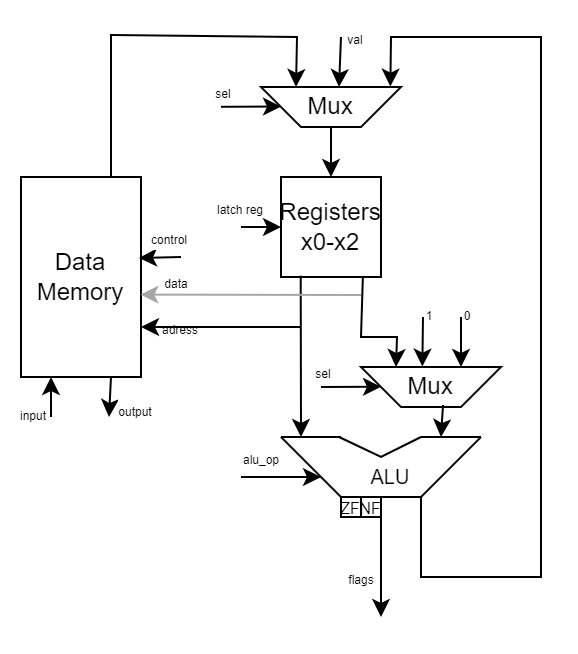
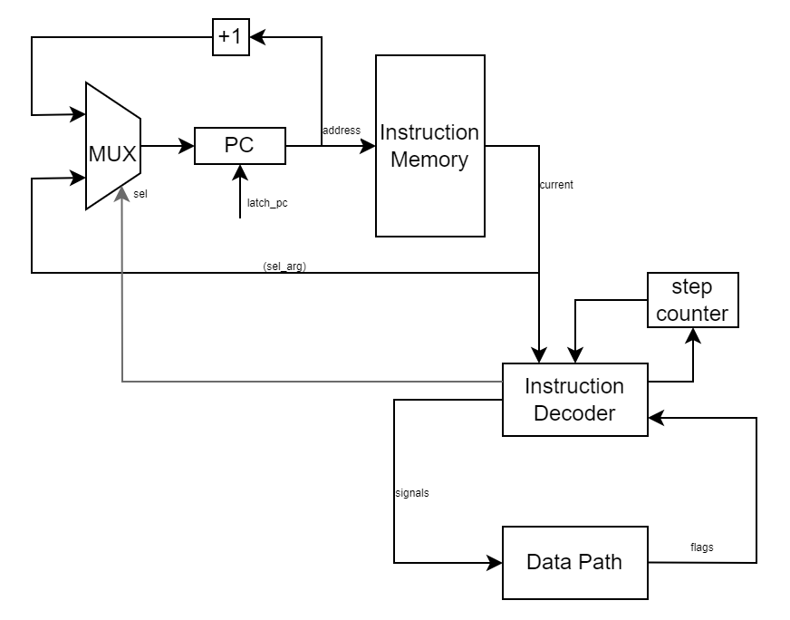

# Лабараоторная работа №3 "Эксперимент"

## Вариант
- Дашкевич Егор Вячеславович P3208
```
asm | risc | harv | hw | instr | struct | stream | mem | cstr | prob1 | cache
```
- Упрощенный вариант

### Расшифровка варианта

- синтаксис языка ***Assembler*** с поддержкой label-ов
- ***RISC*** архитектура процессора
- ***Гарвардский*** тип памяти (память команд и данных раздельно)
- ***HW*** - Control Unit реализуется как часть модели
- Точность модели до ***Инструкций***
- Машинный код представляется в виде ***высокоуровневой структуры данных***
- Ввод-вывод осуществляется как ***поток токенов***
- Порты ввода-вывода отображаются в ***память***
- ***Нуль-терминированые строки*** (cstring)

## Язык программирования
В качестве языка программирования реализовано сокращенное подможество языка Assembler, решающее конкретные задачи.

(см. [Алгоритмы](algorithms))

### Синатксис Языка
```ebnf
program ::= { line }-

line ::= section "\n"
       | label "\n"
       | instr "\n"
       | data "\n"

section ::= "section .data:"
          | "section .text:"

label ::= label_name ":"

data ::= label_name ": " "\"" {<any symbol except ":">} "\0\""

label_name ::= <any symbols except ":">

instr ::= op0
        | op1 label_name
        | op2 reg
        | op3 reg ", " (int | reg)

op0 ::= "hlt"
      | "nop"

op1 ::= "jmp"
      | "jz"
      | "jl"

op2 ::= "in"
      | "out"
      | "inc"
    
op3 ::= "mv"
      | "add"
      | "sub"
      | "ld"
      | "st"
      | "cmp"

reg ::= "x" <any of "0-2">
```

### Семантика
Код выполняется последовательно - строка за строкой

Метки определяются на отдельной строке исходного кода: 
```asm
label:
    word 42 
```
Далее метки могут использоваться в любом месте исходного кода (как до так и после объявления метки)

Метки не чувствительны к регистру, повторение меток недопустимо.
Метки считаются одинаковыми если единственное их различие - регистр символов:
```
"label" == "LaBeL"
```

Использование меток не ограничено по количеству
Транслятор поставит вместо метки адрес команды перед которой она объявлена

Любая программа должна иметь секцию ".text" указывающую на начало инструкций

## Организация памяти
Память построена по Гарвадской модели: память данных и память инструкций разделены

### Регистры
Система основана на RISC архитектуре, поэтому в распоряжении разработчика есть 3 регистра общего пользования
(достаточно для реализации необходимых алгоритмов). 

Помимо этого существуют служебные регистры, прямого доступа к которым нет

Для обеспечения условной адресации существует 2 флага - zf(ноль), nf(отрицательное)

### Память данных
Размер машинного слова не определен - данные хранятся как список строк

Организация памяти:

| Адрес |    Содержимое     |
|:------|:-----------------:|
| 0     |    порт ввода     |
| 1     |    порт вывода    |
| 2     |   переменная #0   |
| ...   |        ...        |
| n     | переменная #(n-2) |
| ...   |        ...        |

* доступ к памяти через любой регистр общего назначения
* ячейки 0 и 1 - выделены под IO
* литералы и константы не поддерживаются

### Память инструкций
Размер машинного слова не определен - инструкции хранятся как высокоуровневоя структура данных

Организация памяти:
* вся память выделена под инструкции, выполнение начинается с 0 адреса
* поддерживается условная и абсолютная адресация
* у разработчика доступ к памяти отсутствует, за исключением меток
* прерывания не поддерживаются

## Система команд 

### Особенности процессора:
* Машинное слово - не определено
* Типы данных - знаковые числа или символы (в модели хранятся в качестве строки длины 1)
* Несколько регистров общего назначения, доступные разработчику + служебные регистры
* Поток управления:
  * Регистр PC инкрементируется после каждой инструкции (кроме переходов)
  * Условные и безусловные переходы

### Набор инструкций
* **hlt** - остановка программы
* **nop** - отстутствие инструкции
* **jmp { program_address }** - абсолютный переход
* **jz { program_address }** - условный переход. Перейти, если результат последней операции равен 0
* **jl { program_address }** - условный переход. Перейти, если результат последней операции меньше 0
* **in { target_register }** - ввести данные с устройства ввода
  * Сокращение команды *ld reg input_port* в языке, в isa только ld
* **out { source_register }** - вывести данные на устройство вывода
  * Сокращение команды *st output_port* в языке, в isa только st
* **inc { register }** - увеличить значение на 1
* **mv { target_register } { source_register | int }** - операция перемещения данных между регистрами
* **add { target_register } { source_register | int }** - операция сложения
* **sub { target_register } { source_register | int }** - операция вычитания
* **ld { target_register } { memory_address }** - выгрузить значение из памяти
* **st { source_register } { memory_address }** - загрузить значение в память
* **cmp { register } { register | int }** - сравнить числа (zf = 1 если равны)

Обозначения: 
* program_address - адрес в памяти инструкций, обычно является меткой
* register - регистр общего назначения
* int - целочисленное знаковое число
* memory_address - адрес в памяти данных, обычно является меткой

### Кодирование инструкций
Инструкции заданы высокоуровневой структурой данных. Для записи машинного кода используется json

## Транслятор
**Использование:** './src/translator.py <asm_file> <data_out_file> <instr_out_file>'

Транслятор языка работает в 3 этапа:
* **Препроцессинг** - разбивает файл на значащие линии, убирает пустые строки и лишние пробелы
* **Первый проход** - транслирует память данных и память инструкций. Создает словарь метка:адрес. 
Также на этом этапе происходит трансляция команд *in* и *out* в инструкции *ld* и *st*
* **Второй проход** - заменяет метки в памяти инструкций на адреса, согласно словарю метка:адрес

## Модель процессора

### Data Path



Реализован в классе DataPath 

Сигналы:
* ``alu_op`` - сигнал операции алу
* ``control`` - сигналы контроля памяти (запись, вывод)
* ``latch_reg`` - сигналы защелкивания конкретного регистра

``input, output`` - вход и выход внешнего устройства (запись перезватывается при обращении на порт)
``ZF, NF`` - флаги результата операции
### Control Unit

Реализован в классе ControlUnit



Сигналы:
* ``signals`` - управляющие сигналы, идущие на DataPath
* ``latch_pc`` - защелкивание счетчика программы (инструкции)

``sel_args`` - обрезает инструкцию до её аргумента (адресса перехода) для команд перехода
``step counter`` - счетчик тактов, необходим для правильной работы инструкций, занимающих несколько тактов
``flags`` - флаги операции с алу, необходимы для условных переходов

## Тестирование